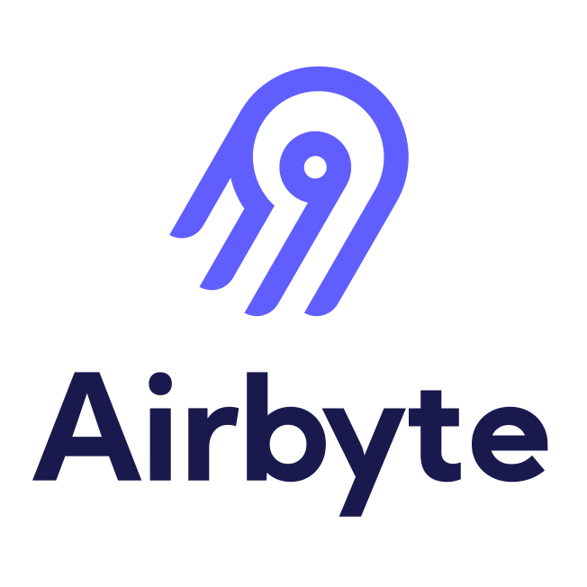

<!-- Banner or Title -->
<h1 align="center">Hello, I'm Burny!</h1>
<h3 align="center">ML & Data Engineer | TU Berlin Graduate </h3>

<!-- Typing SVG (Optional) -->

  

<!-- Profile or Portfolio Link -->

  

---

- 🔭 I’m currently working on **Data Engineering & Machine Learning** projects.
- 🔍 Exploring innovative **AI Agents** and deep diving into **MLOps**.
- ⚡ Fun fact: I do photography in my free time.
- 🔗 Feel free to **connect with me on LinkedIn**: [LinkedIn Profile](https://linkedin.com/in/syed-ali-murad-tahir)

---

<!-- Tech Stack / Languages -->
### Languages & Tools

  <!-- C -->
  

  <!-- C++ -->
  

  <!-- Python -->
  

  <!-- SQL -->
  

  

  

### Tools & Technologies

#### Data Engineering Tools

  
  
  
  

#### Visualization Platforms

  
  
  
  
  

#### Deployment & Collaboration

  
  
  
  

#### Libraries and Frameworks

  
  
  
  
  
  
  

<!-- GitHub Stats (Optional) 

  
<b>My GitHub Stats</b>

   
  

    
  

  

    
  

-->

<!-- GitHub Trophy (Optional) 

  
<b>Trophies</b>

   
  

    
  

-->
